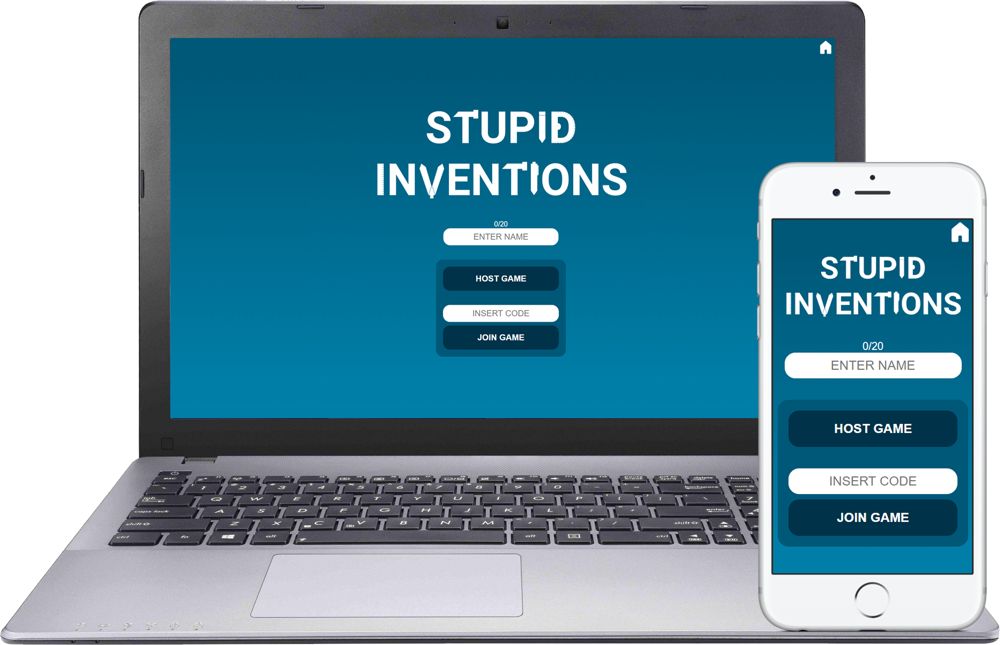
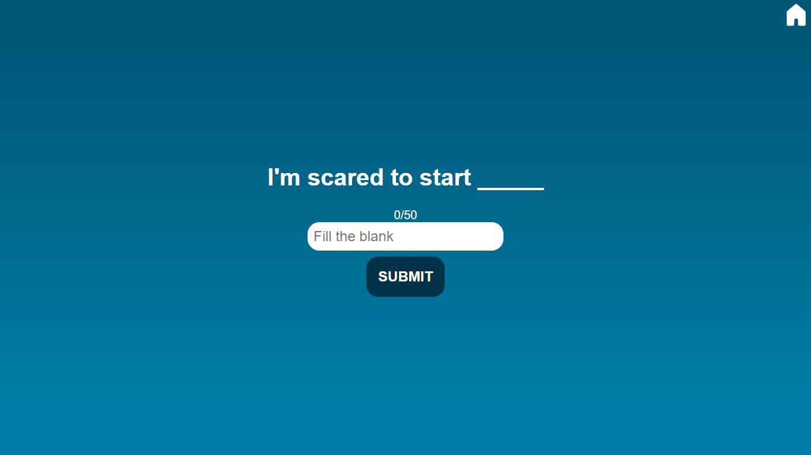
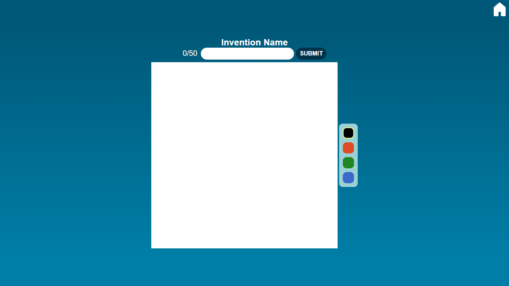
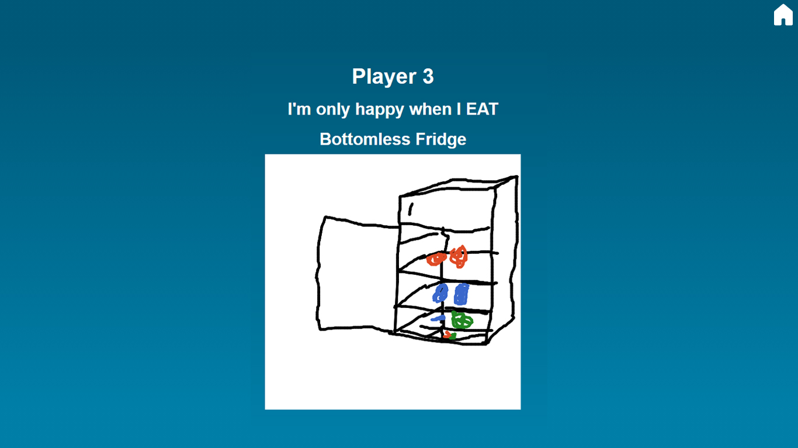
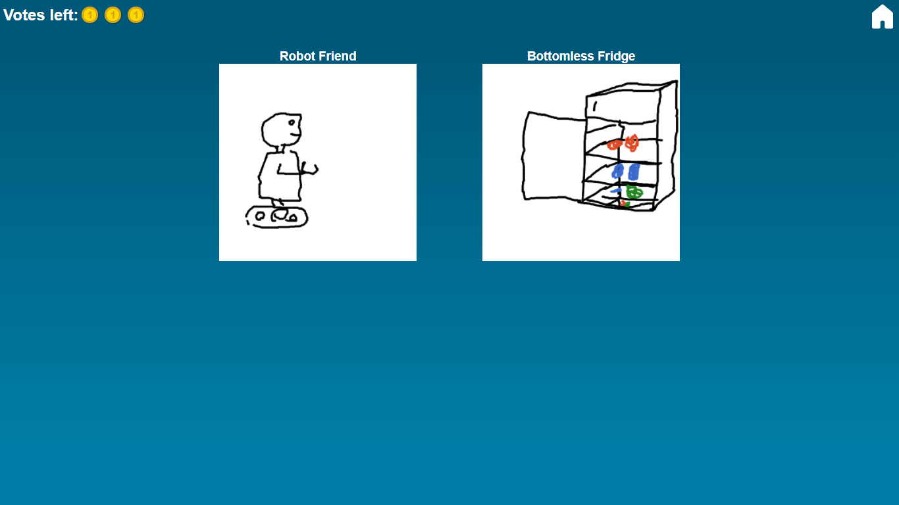
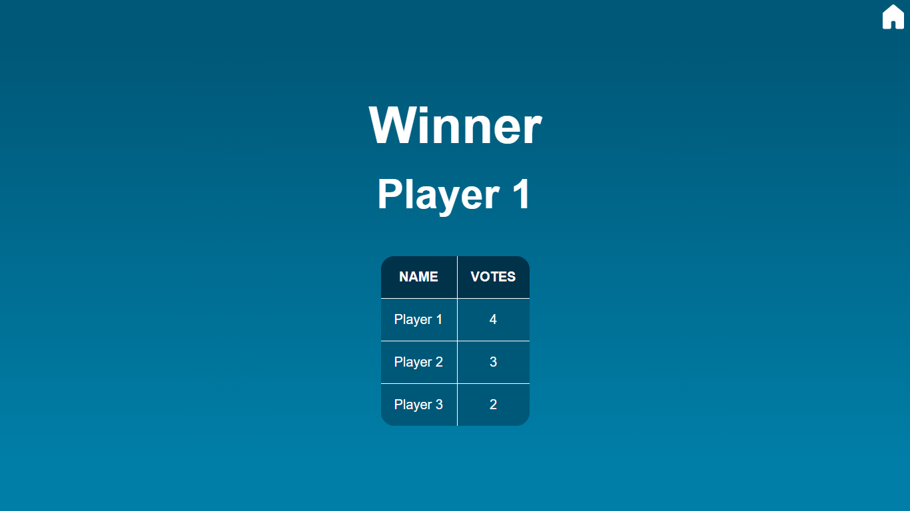

<h1 align="center">Stupid Inventions</h1>

<b>✏️ A multiplayer in browser game to help improving presentation skills in a real-time drawing competition.</b>

 

</img>

  

- 
Think of a problem based on the prompt

- 
Create domething to solve it

- 
Present it to your friends

- 
Distribute your votes among your favorites

- 
🎉Win!!🎉

## Getting Started

* Install the dependencies with `npm install`
* Create the local MongoDB instance and run `node server/populateDb/populateDb.js` to populate the database with the default set of questions.
* Run `npm run dev` to start the development server and the client.

## Tech Stack

* React
* ExpressJS
* Socket.io
* Mongoose

## Contributors

#### Idea and initial version:

</img> Nikos Cocci |
--- |
[GitHub](https://github.com/Nik439) |
[LinkedIn](https://www.linkedin.com/in/nikos-cocci/) |

#### Additional features and testing:

</img> Peter Ackroyd | </img> Özgür Tanrıverdi
--- | ---
[GitHub](https://github.com/Snugles) | [GitHub](https://github.com/otanriverdi)
[LinkedIn](https://www.linkedin.com/in/peter-ackroyd/) | [LinkedIn](https://www.linkedin.com/in/otrv/)
